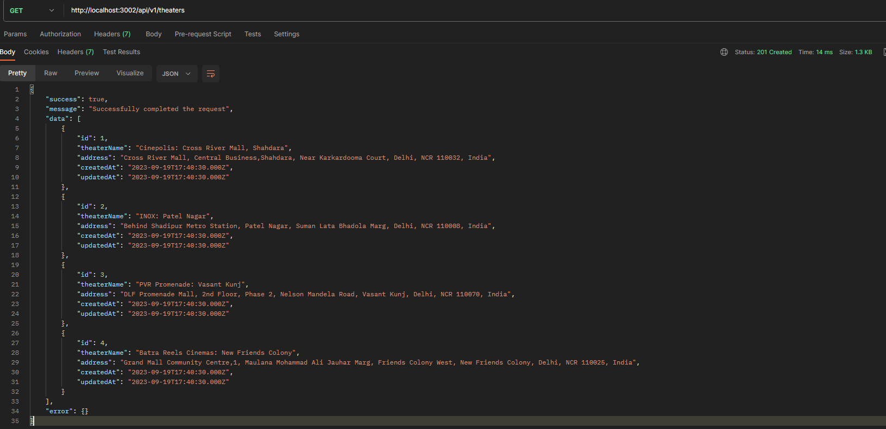
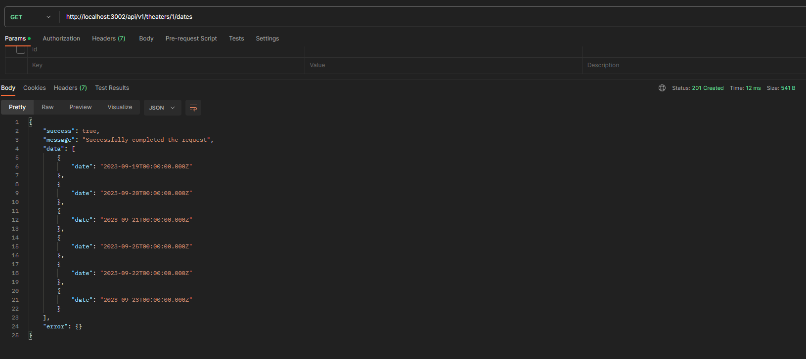
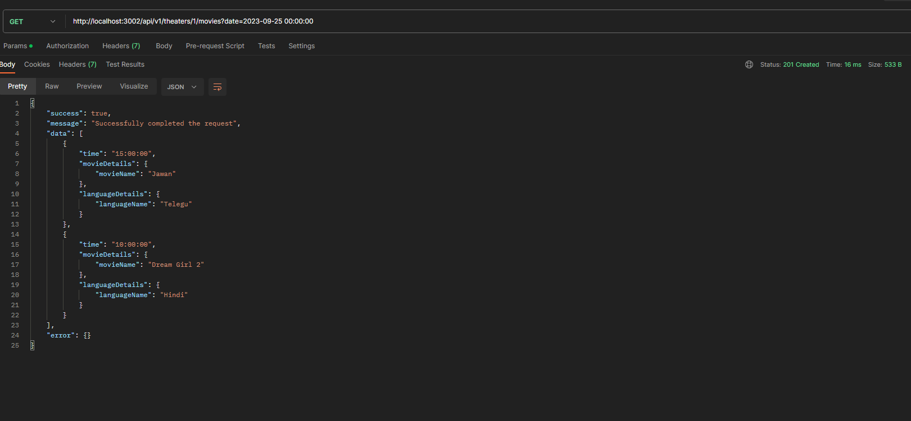

# **API DOCUMENTATION**
## **Endpoints**
- **GET** /api/v1/theaters
<p align="center">
  
</p>
- **GET** /api/v1/theaters/:id/dates


- **GET** /api/v1/theaters/:id/movies?date=2023-09-25 00:00:00


- **GET** /api/v1/theaters/:id/movies?date=2023-09-25 00:00:00


## **Project Structure**
The project structure is designed to keep the code organized and easy to navigate. Here's a breakdown of the main folders and their purposes:

  - `src`: This folder contains all the source code for the project, excluding tests. You can add your application code here.

  - `config`: This folder is dedicated to configuration files. It includes setup for libraries or modules used in the project, such as `dotenv` for managing environment variables or a logging library for meaningful logs. You can configure these libraries in the respective files.

  - `routes`: In this folder, you register routes and define the corresponding middleware and controllers for handling incoming requests.

  - `middlewares`: Middlewares intercept incoming requests and allow you to implement validators, authenticators, and other request processing logic.

  - `controllers`: Controllers act as the last middlewares in the request pipeline. They receive incoming requests and data, call the business layer to execute the logic, and structure the API response before sending it back.

  - `repositories`: This folder contains the logic for interacting with the database. You can write raw queries or use an ORM (Object-Relational Mapping) here.

  - `services`: Services encapsulate the business logic of your application. They interact with repositories to retrieve and manipulate data from the database.

  - `utils`: The utils folder houses helper methods, error classes, and other utility functions that can be reused throughout the project.

## **Project Setup**
To set up the project, follow these steps:

  - Download this template from GitHub and open it in your favorite text editor.

  - Navigate to the project's root directory in the terminal and execute the following command to install dependencies:

    ```bash
    npm install
    ```
  - In the root directory, create a .env file and add the following environment variable:
    ```js
    PORT=<port number of your choice>
    ```
    For example:
    ```
    PORT=3001
    ```
  - Go inside the src folder and execute the following command to initialize Sequelize (a popular ORM for Node.js):
    ```bash
    npx sequelize init
    ```
    This command will generate the migrations and seeders folders, along with a config.json file inside the config folder.
    
  - If you are setting up the development environment, specify the username and password for your database in the config.json file. Also, mention the     
    dialect corresponding to your database (e.g., mysql, mariadb).
    ```json
    "development": {
      "username": "username", 
      "password": "password",          
      "database": "database_name",
      "host": "127.0.0.1",          
      "dialect": "mysql"             
    }
    ```
  - If you are setting up the test or production environment, ensure that you replace the host with the URL of your hosted database.

  - Run Migrations
    ```bash
    npx sequelize-cli db:migrate
    ```

  - Run Seeders to add sample data in your database
    ```bash
    npx sequelize db:seed --seed
    ```
  - To run the server, execute the following command in the project's root directory:
    ```bash
    npm run dev
    ```
